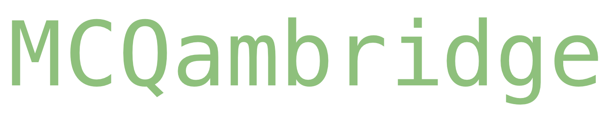

## Overview
MCQambridge is an automated MCQ past paper solving application for Cambridge A-levels & IGCSE.

## Installation & Usage

1. Clone the repository with: `git clone https://github.com/ghassbomb/mcqambridge.git`
2. Change into the project directory: `cd mcqambridge`
3. Create a virtualenv environment (optional)
4. Install the required dependencies using pip: `pip install -r requirements.txt`
5. Start the Flask development server: `python app.py`
6. Enjoy!

## Features
Paper selector with options for:
- Subject
- Year (2018-)
- Month
- Level (core/extended)
- Variant

Score calculation and an answer view where you can see all your answers—right or wrong. Statistics to keep track of the papers you’ve completed and the scores you’ve gotten.

Currently, MCQambridge supports the following subjects:

- **IGCSE**
	- Economics (0455)
	- Biology (0610)
	- Chemistry (0620)
	- Physics (0625)
	- Science Combined (0653)

- **O-Levels**
	- Economics (2281)
	- Physics (5054)
	- Chemistry (5070)
	- Biology (5090)
	- Science Combined (5129)

- **A-Levels**
	- Biology (9700)
	- Chemistry (9701)
	- Physics (9702)
	- Accounting (9706)
	- Economics (9708)

*Note that **not all subjects or papers may work**. If there is an error, see the [contributions](#contributions) section for reporting it.*

## Contributions

Contributions are welcome! If you have any suggestions, improvements, or bug fixes, please create a pull request. For major changes, please open an issue to discuss the changes beforehand. You can also contact me at `ghass.shahzad@gmail.com` for any requests and such, but you should ideally open an issue.

## License

This project is licensed under the [MIT License](https://choosealicense.com/licenses/mit/).