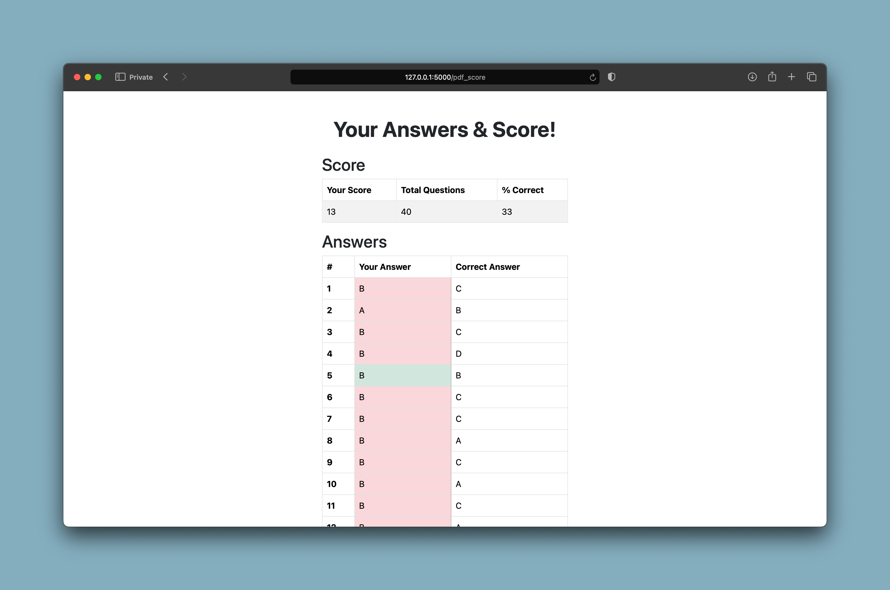

<h1 align="center">
  <a href="https://github.com/ghassbomb/mcqambridge">
    <!-- Please provide path to your logo here -->
    
  </a>
  
MCQambridge

    
</h1>
<figure>
        
      </figure>
      

        MCQambridge is an automated MCQ past paper solving application for
        Cambridge A-levels & IGCSE. I created it to simplify the process of checking
        answers, calculating scores, and percentages. It was created using
        Python and the web development trio.
      

      
Currently, it supports all CAIE IGCSE/O/A level papers. I plan to add support for other variants, and maybe I'll even expand it to include structured questions. There is no website however, as I was unable to acquire free hosting that supports download requests for the QP and MS pdfs, so you'll have to host it yourself. It is an extremely simple <a href="#installation--usage">5-step process</a>, however.

      
## Usage

To begin, you first select a paper. You can choose between every Cambridge paper released 2018 and onwards. Aside from the year, you can choose between: subject, month (period), level (core, or extended?), and variant. You can see all these options in the image below. Once you've chosen a paper, press submit. The app then checks if the paper exists: if it does not, you will be prompted to select another paper; otherwise, it will download the relevant PDFs and redirect you to the paper solving page.

      <figure>
        
      </figure>
      
When solving the paper, you are presented with the screen shown above. You select one of four lettered options, corresponding to the choices on the MCQ paper. You will be shown immediately if you are correct or incorrect. The PDF viewer (google drive) supports mobile devices, but at the cost of having users scroll back down through the PDF after answering questions.

      <figure>
        
      </figure>
      
Once you are done with a paper, you will be shown your results. You will get your overall score, percentage, and also a question-by-question breakdown of the parts you got wrong.

      <figure>
        
      </figure>
      
At any time, you can access a statistics page that showcases all the papers you've attempted so far and the results you got in them. This makes it easy to track your progress; to answer questions like 'am I getting better in subject <em>x</em>'?

      

## Getting Started

### Prerequisites

This project requires Python 3 (any version of Python 3 that supports the requirements will do).

### Installation & Usage

1. Clone the repository with: `git clone https://github.com/ghassbomb/mcqambridge.git`
2. Change into the project directory: `cd mcqambridge`
3. Create a virtualenv environment (optional)
4. Install the required dependencies using pip: `pip install -r requirements.txt`
5. Start the Flask development server: `python app.py`
6. Enjoy!

## Roadmap

See the [open issues](https://github.com/ghassbomb/mcqambridge/issues) for a list of proposed features (and known issues).

- [Top Feature Requests](https://github.com/ghassbomb/mcqambridge/issues?q=label%3Aenhancement+is%3Aopen+sort%3Areactions-%2B1-desc) (Add your votes using the 👍 reaction)
- [Top Bugs](https://github.com/ghassbomb/mcqambridge/issues?q=is%3Aissue+is%3Aopen+label%3Abug+sort%3Areactions-%2B1-desc) (Add your votes using the 👍 reaction)
- [Newest Bugs](https://github.com/ghassbomb/mcqambridge/issues?q=is%3Aopen+is%3Aissue+label%3Abug)

## Contributing

Contributions are welcome! If you have any suggestions, improvements, or bug fixes, please create a pull request. For major changes, please open an issue to discuss the changes beforehand. You can also contact me at `ghass.shahzad@gmail.com` for any requests and such.

Please read [our contribution guidelines](docs/CONTRIBUTING.md), and thank you for being involved!

## License

This project is licensed under the **MIT license**.

See [LICENSE](LICENSE) for more information.

## Acknowledgements

Thanks to Abbas Fanhim for providing the [inspiration](https://github.com/Abban-Fahim/MCQ/).
