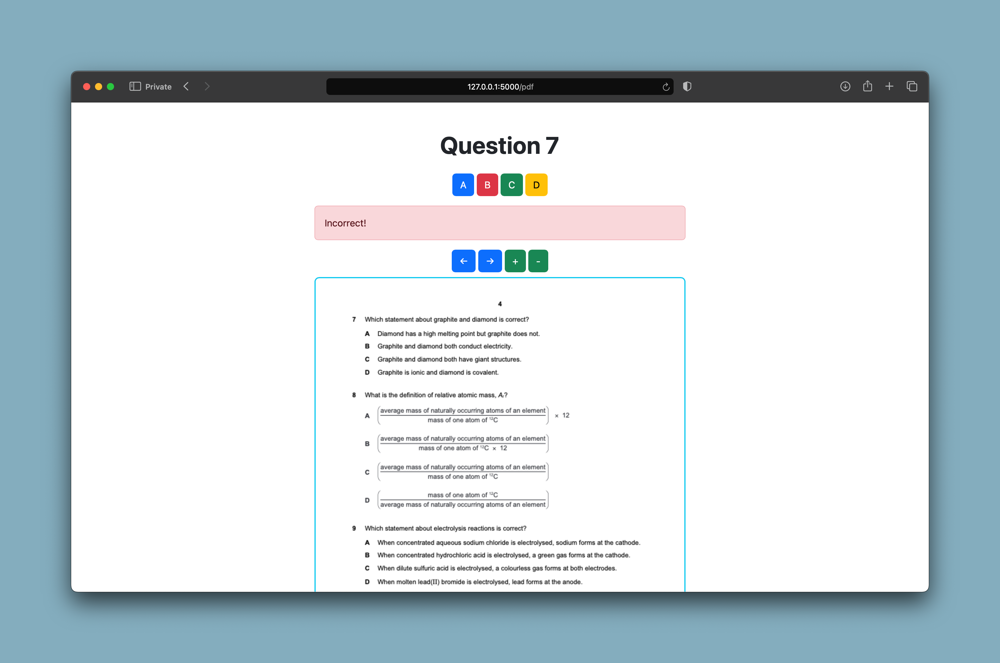

<h1 align="center">
  <a href="https://github.com/ghassbomb/mcqambridge">
    <!-- Please provide path to your logo here -->
    
  </a>
  
MCQambridge

    
</h1>
<figure>
        
      </figure>
      

        MCQambridge is an automated MCQ past paper solving application for
        Cambridge A-levels & IGCSE. I created it to simplify the process of checking
        answers, calculating scores, and percentages. It was created using
        Python and the web development trio. You can access it <a href="https://ghassbomb.pythonanywhere.com">here</a> or you can <a href="#installation--usage">host it yourself</a>. (I would appreciate if you hosted it locally, since my pythonanywhere site has limited bandwith; it's a simple five-step process!) 
      

      
## Usage

To begin, you first select a paper. You can choose between every Cambridge paper released 2018 and onwards. Aside from the year, you can choose between: subject, a-level, month, level (core, or extended?), and variant. Once you've chosen a paper, press submit.

      <figure>
        
      </figure>
      
When solving the paper, you are presented with the screen shown above. You select one of four lettered options, corresponding to the choices on the MCQ paper. You will be shown immediately if you are correct or incorrect. You can zoom in or out of the PDF, and navigate between pages.

      <figure>
        
      </figure>
      
Once you are done with a paper, you will be shown your results. You will get your overall score, percentage, and also a question-by-question breakdown of the parts you got wrong.

      <figure>
        
      </figure>
      
At any time, you can access a statistics page that showcases all the papers you've attempted so far and the results you got in them. This makes it easy to track your progress; to answer questions like 'am I getting better in subject <em>x</em>'?

      

## Getting Started

### Prerequisites

This project requires Python 3 (any version of Python 3 that supports the requirements will do).

### Installation & Usage

1. Clone the repository with: `git clone https://github.com/ghassbomb/mcqambridge.git`
2. Change into the project directory: `cd mcqambridge`
3. Create a virtualenv environment (optional)
4. Install the required dependencies using pip: `pip install -r requirements.txt`
5. Start the Flask development server: `python app.py`
6. Enjoy!

## Roadmap

See the [open issues](https://github.com/ghassbomb/mcqambridge/issues) for a list of proposed features (and known issues).

- [Top Feature Requests](https://github.com/ghassbomb/mcqambridge/issues?q=label%3Aenhancement+is%3Aopen+sort%3Areactions-%2B1-desc) (Add your votes using the 👍 reaction)
- [Top Bugs](https://github.com/ghassbomb/mcqambridge/issues?q=is%3Aissue+is%3Aopen+label%3Abug+sort%3Areactions-%2B1-desc) (Add your votes using the 👍 reaction)
- [Newest Bugs](https://github.com/ghassbomb/mcqambridge/issues?q=is%3Aopen+is%3Aissue+label%3Abug)

## Contributing

Contributions are welcome! If you have any suggestions, improvements, or bug fixes, please create a pull request. For major changes, please open an issue to discuss the changes beforehand. You can also contact me at `ghass.shahzad@gmail.com` for any requests and such.

Please read [our contribution guidelines](docs/CONTRIBUTING.md), and thank you for being involved!

## License

This project is licensed under the **MIT license**.

See [LICENSE](LICENSE) for more information.

## Acknowledgements

Thanks to Abbas Fanhim for providing the [inspiration](https://github.com/Abban-Fahim/MCQ/).
